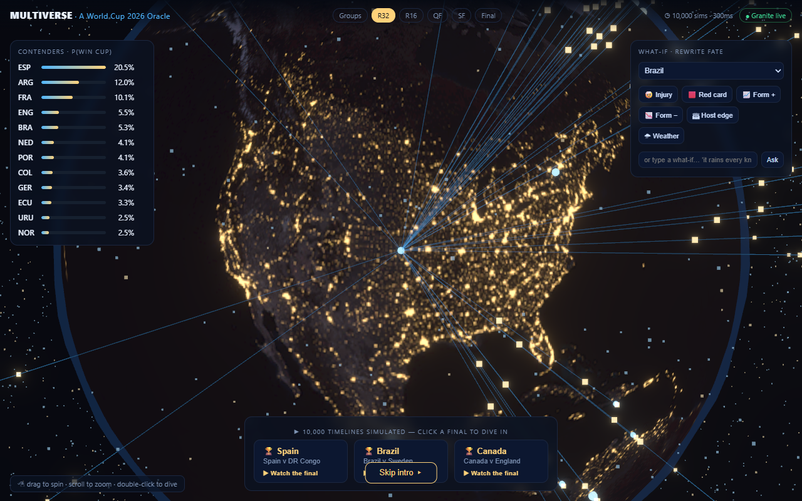
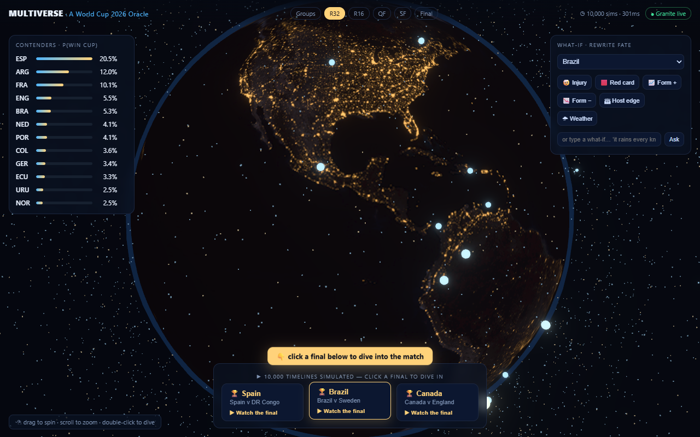
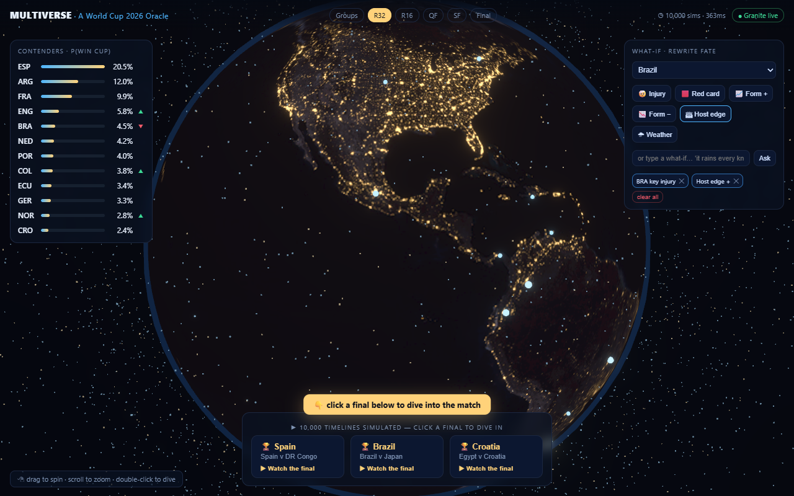
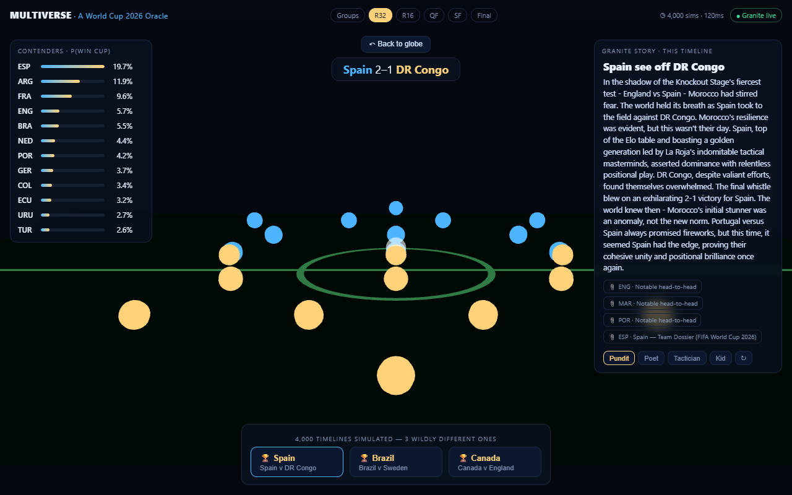

# MULTIVERSE — A World Cup 2026 Oracle 🌌⚽

**An explorable counterfactual multiverse for the FIFA World Cup 2026.** Not a single prediction — a space of *thousands* of simulated tournaments you can fly through, perturb with "what-ifs," and ask *why*. Built for the **IBM SkillsBuild AI Builders Challenge** (June / FIFA World Cup track).

**Repo:** https://github.com/kayadibi1/multiverse-worldcup

> Simulate the entire 48-team tournament 10,000 times in the browser, render the result as a living 3D globe of probability, drop in an injury or a storm and watch the futures ripple, then dive into any match to watch a **formation-constellation duel** narrated by **IBM Granite** — grounded in real facts extracted by **IBM Docling**.



*Cold open: the world descends on North America.* …resolving into the interactive **Oracle Globe** (a real night-Earth with win-probability markers hovering over each nation):



---

## 1. The problem

Every World Cup spawns a billion arguments — *"What if Brazil's playmaker hadn't pulled up? What if that group had broken differently?"* Fans get a **single** prediction (one bracket, one favorite) from a pundit or a betting line: a flat number with no *why* and no way to interrogate it. The space of what *could* happen — the thing that makes the tournament thrilling — is invisible.

## 2. The AI / technical approach

MULTIVERSE turns prediction into **exploration**, with each IBM tool doing a real job:

- **IBM Granite (`granite3.3:2b`, local via Ollama)** — *two load-bearing roles.* (a) Parses free-text what-ifs ("it rains every knockout night") into typed simulation modifiers — the one place the AI actually *changes the model*. (b) Narrates any timeline in a chosen voice (Pundit / Poet / Tactician / Kid), returning **grounded** stories with citations. Granite is **never** called inside the 10,000-sim hot loop.
- **IBM Docling** — ingests team-dossier documents → structured, retrievable **facts** that appear on screen as **citation chips** in Granite's narratives (the `Docling → KB → Granite` chain is visible, not a checkbox). Runs once, offline, to build `data/kb`.
- **Langflow** — the *Ratings → Strength Table* and *Narrative* pipelines are authored as importable flow JSON in [`langflow/`](langflow/); the runtime mirrors them in FastAPI (see honesty note below).
- **Context Forge** — an MCP gateway config in [`contextforge/`](contextforge/) fronting the retriever tool (embedding + BM25 RAG over the Docling KB).

**The engine.** A seeded Monte-Carlo (mulberry32 PRNG) runs the *real* WC 2026 format — 12 groups of 4 → 8 best third-placed → Round of 32 → Final — using an independent-Poisson goals model derived from World-Football-Elo ratings. 10,000 full tournaments (~1.03M matches) run **client-side in a Web Worker in well under a second**, so every what-if re-runs instantly. The GPU draws; the worker computes.

**Architecture** (`docs/spec.md` §7):
```
CLIENT  React + react-three-fiber/Three.js · GPU particle globe · Monte-Carlo Web Worker
   ↑ HTTP / SSE ↓
API     FastAPI  /ratings /intervene /narrate(SSE) /feed /anchor /health
   ↕
AI      IBM Granite (Ollama) · Context-Forge-fronted retriever (nomic-embed-text + BM25)
   ↕
DATA    IBM Docling ingestion → KB (structured + facts + embeddings) · real final draw
```

## 3. Why it matters (in the context of football)

- **It restores the drama of uncertainty.** Showing the *space* of futures — Spain at ~20%, but Morocco, Croatia, even Canada with real, visible paths — is truer to the sport than a single confident bracket, and far more fun to argue with.
- **It's interrogable.** "Rewrite fate": injure a striker, force a result, amplify the host edge — and *see* the favorite fall and an underdog rise, with the engine's numbers, not vibes.
- **It's timely & anchorable.** WC 2026 runs *during* the judging window; the same Force-result mechanism that powers what-ifs also **anchors the multiverse to real completed fixtures** (`/api/anchor`).

| Inject a what-if → ripple | Dive into a match → Granite narrates |
|---|---|
|  |  |

## 4. Run it

**Prereqs:** Node 18+, Python 3.11+ (3.14 works). *Optional* for live AI: [Ollama](https://ollama.com) with `granite3.3:2b` + `nomic-embed-text`. **Without Ollama the app still fully runs** — a deterministic what-if parser and an offline narrator (which still cites real Docling facts) take over.

```powershell
# One command (Windows PowerShell):
./scripts/run.ps1
# then open http://localhost:8000
```
Or manually:
```powershell
python -m venv .venv
.venv\Scripts\python -m pip install -r api\requirements.txt
npm --prefix web install ; npm --prefix web run build
$env:PYTHONPATH="api"; .venv\Scripts\python -m uvicorn multiverse.main:app --port 8000
```
The seed knowledge base (`data/kb/`) is committed, so a fresh clone runs immediately. To rebuild it from the raw dossiers with Docling: `pip install -r api/requirements-ingest.txt` then `PYTHONPATH=api python -m multiverse.ingest`.

**Dev mode** (hot reload, Vite on :5173 proxying to the API on :8000): `./scripts/dev.ps1`.

## 5. IBM-tool honesty (what's deep, what's supporting)

We claim **two deep + two supporting**, stated plainly:
- **Granite — deep & verified.** Real local inference (`granite3.3:2b`); it both *reasons* (free-text → modifiers) and *narrates*. `/api/health` reports `graniteProvider: ollama` in the demo. Provider chain: Ollama → watsonx (only if `WATSONX_*` env vars are set — wired but inactive in the demo) → deterministic offline template (always-on guarantee).
- **Docling — deep & verified.** Real `docling 2.97` + `docling-ibm-models` parse the dossiers; the extracted facts appear as on-screen citation chips.
- **Langflow — supporting.** Langflow does **not** pip-install on Python 3.14, so the flows in `langflow/` are authored against its schema and **mirrored 1:1 in the FastAPI code** that actually runs; we do not claim a live Langflow server in the demo.
- **Context Forge — supporting.** It is an MCP *gateway*, not a retriever. `contextforge/gateway.json` exposes our retriever as an MCP tool; in the demo FastAPI calls the retriever directly.

## 6. Data provenance

The 48-team field and final group draw are the **real** FIFA World Cup 2026 draw (held 2025-12-05). Strength ratings use **World Football Elo** (snapshot 2026-06-01) and FIFA ranking (April 2026), aggregated from public sources for this non-commercial demo (`data/raw/teams.research.json`). Team-dossier prose (`data/raw/dossier_*.md`) is original.

## 7. Known approximations (deliberate, documented)

1. **Independent Poisson** goals model (not full Dixon-Coles — the low-score correlation term is omitted).
2. **Group tie-breaks** use points → goal-difference → goals-for → seeded lot (the official head-to-head criteria are simplified).
3. **Best-thirds → R32 slots** are assigned by rank order with a bounded same-group-avoidance swap — a faithful approximation of FIFA's exact thirds-combination table (`web/src/sim/bracket2026.ts`).
4. The **third-place playoff** is omitted (irrelevant to champion/reach probabilities).

---

## Verification

The full MVP is verified by a headless Playwright suite (SwiftShader WebGL) plus engine unit tests — see [`docs/verification.md`](docs/verification.md). Highlights: 25/25 simulation invariants (incl. `Σ P(champion) = 1 ± 1e-6`), and 4 end-to-end browser tests (globe boots → injury ripples the leaderboard → dive to stadium → Granite story with a Docling citation), all green.

**Tech:** React · TypeScript · Three.js / react-three-fiber · Web Workers · Zustand · FastAPI · IBM Granite · IBM Docling · Langflow · Context Forge · Ollama.

*Decision log:* [`DECISION-JOURNAL.md`](DECISION-JOURNAL.md) records the why behind every major choice (including a 7-agent spec review and an 11-agent plan review).

🤖 Built with [Claude Code](https://claude.com/claude-code).
